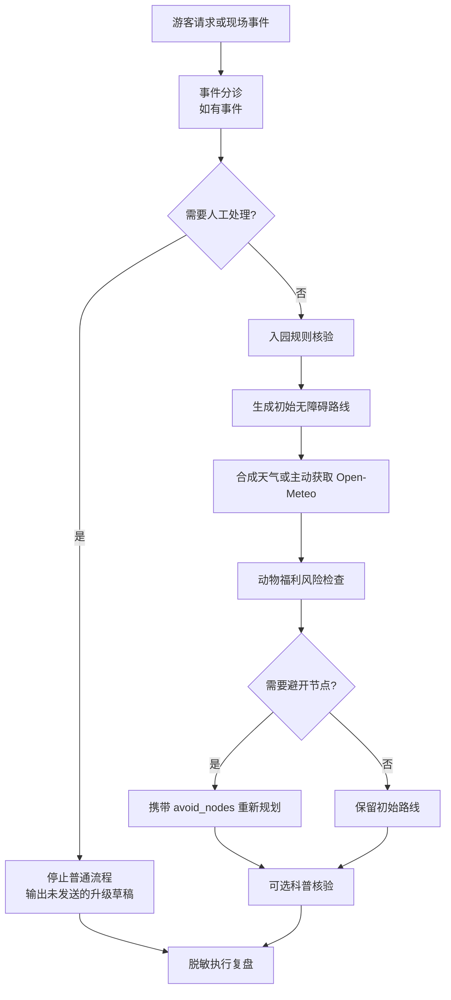

# PandaFlow｜熊猫守望

面向大型动物主题文旅场所的**可审计多 Skill 协同原型**。PandaFlow 将入园规则、无障碍路线、天气与动物福利、现场事件分诊、科普核验和运营复盘串成一个可离线验证的闭环。

> **English summary:** PandaFlow is an auditable multi-skill orchestration prototype for visitor experience and animal-welfare-aware operations in large animal-themed venues. Its deterministic rule core runs offline, while current weather is an explicit opt-in integration with a safe synthetic fallback.

`Python 3.11+` · `FastAPI` · `Pydantic 2` · `6 independent Skills` · `146 Python + 8 JavaScript tests` · `MIT`

> [!IMPORTANT]
> PandaFlow 是参赛与技术验证原型，不是成都大熊猫繁育研究基地的官方系统，也不代表双方存在合作或授权。项目不会购票、核验真实身份、发送真实工单、诊断或治疗，也不声称掌握实时动物状态。

## 在线演示

已部署 [四场景 Demo](https://pandeflow.yikuaibanz.cn/demo)、[API 文档](https://pandeflow.yikuaibanz.cn/docs) 和 [OpenAPI](https://pandeflow.yikuaibanz.cn/openapi.json)。公开演示接口无需登录，只处理演示输入，不发送真实工单。公网烟测与部署说明见 [HTTPS 部署](docs/https-deployment.md)；WorkHub 平台联调和上架仍未完成。

## 为什么做 PandaFlow

带老人和儿童的游客想在有限时间内获得一条可执行路线，不能只靠“热门景点推荐”。预约规则、无障碍要求、天气、区域状态、动物福利和突发事件都可能改变计划。

PandaFlow 的核心演示不是生成一段更漂亮的话，而是让约束真正影响结果：当演示高温达到福利规则阈值时，初始路线中的室外 `bamboo_grove` 节点会被风险 Skill 标记并交给路线 Skill 重算，最终路线明确避开该节点；如果先收到走失或医疗类高风险事件，普通规划会被立即阻断并转为人工升级草稿。

## 六个独立 Skill

| Skill | 职能 | 主要输出 |
|---|---|---|
| `visitor-policy-check` | 固定故事入园字段核验 | 日期、时段、预约与证件类型的完整性结论 |
| `accessible-itinerary-planner` | 合成图无台阶路线规划 | 120 分钟游览段、停留/休息点、硬约束拒绝 |
| `welfare-risk-dispatcher` | 动物福利风险调度 | 风险等级、应避节点、是否需要重规划 |
| `panda-knowledge-guard` | 有来源的科普问答 | 登记知识、引用、无依据时拒答 |
| `incident-triage-dispatch` | 现场事件分诊 | P0–P3、负责岗位、未发送的处置草稿 |
| `operations-review` | 脱敏运营复盘 | 调用统计、规则命中、带记录编号的观察 |

总控只负责状态编排，不计作第七个 Skill。核心规则保持确定性，HTTP 层只做输入输出适配。

## 工作流



安全优先级固定为：**人身安全 > 动物福利与园区规则 > 无障碍 > 游览偏好**。普通流程或复盘结果不能覆盖更高风险状态。

## 四个可运行场景

预设请求位于 [`resources/demo_scenarios.json`](resources/demo_scenarios.json)。

| 场景 | 预期结果 |
|---|---|
| 常规游览 + 失物 + 科普 | 六 Skill 协作，保留路线并返回科普来源与复盘记录 |
| 合成高温改线 | 初始路线经过竹林，风险检查后重新规划并避开竹林 |
| 儿童走失 | 在天气和路线调用前停止普通规划，返回人工升级草稿 |
| 当天实时天气 | 主动调用 Open-Meteo；超龄、异常未来、断网或非法响应时降级到固定高温快照并继续安全改线 |

所有场景、园区图、客流和回退天气均为演示数据，并在响应中保留 `demo_data` 和警告信息。

## 本地运行

项目推荐使用 [`uv`](https://docs.astral.sh/uv/) 管理环境：

```bash
git clone https://github.com/YIKUAIBANZI/PandaFlow.git
cd PandaFlow

uv sync --locked --extra test

uv run --locked python -m pytest -q
uv run --locked uvicorn pandaflow.api.app:app --reload
```

启动后可访问：

- 四场景演示页：<http://127.0.0.1:8000/demo>
- API 文档：<http://127.0.0.1:8000/docs>
- 可提交 API 文档初版：[`docs/PandaFlow-API接口文档.md`](docs/PandaFlow-API接口文档.md) / [`output/pdf/PandaFlow-API接口文档.pdf`](output/pdf/PandaFlow-API接口文档.pdf)
- 作品简介与 4 分 40 秒演示脚本：[`docs/competition-presentation-kit.md`](docs/competition-presentation-kit.md)
- 健康检查：<http://127.0.0.1:8000/health>
- 资源就绪检查：<http://127.0.0.1:8000/ready>

演示页可一键运行常规六 Skill、高温改线、走失升级和实时天气四个场景，并在同一画面展示路线、天气来源、调用链、复盘及规则证据。实时天气不会因选中场景而自动请求，只有点击“运行所选场景”才会调用后端。

当前预期测试结果为 `146 passed`；前端响应转换另有 `8 passed` 的 Node 内置测试。源码检出目录中直接运行脚本时，可使用 `PYTHONPATH=src`。

## 构建与审计

锁文件、wheel 和可复现源码 ZIP 均可从同一 checkout 验证或生成：

```bash
uv lock --check
uv build --wheel --out-dir dist
uv run --locked python scripts/build_release_archive.py
```

wheel 会携带 9 个 JSON 规则/场景资源、6 份独立 Skill 文档和 Web Demo 静态文件。源码 ZIP 严格按照 `release-manifest.txt` 的逐文件白名单构建，拒绝符号链接，不包含 `AGENTS.md`、`mmr.md`、虚拟环境、缓存或本地 Git 历史。`dist/` 是本地构建产物，不提交到仓库。

运行时依赖审计从 `uv.lock` 导出带哈希的 requirements，再交给固定版本的 `pip-audit`；工具只报告，不自动升级：

```bash
audit_tmp_dir=$(mktemp -d)
uv export --locked --no-dev --no-emit-project \
  --format requirements.txt \
  --output-file "$audit_tmp_dir/runtime-requirements.txt"
uvx --from pip-audit==2.10.1 pip-audit \
  --requirement "$audit_tmp_dir/runtime-requirements.txt" \
  --require-hashes --disable-pip --strict --progress-spinner off
```

## 调用完整 Demo

合成高温场景完全离线、可重复：

```bash
curl -sS --fail-with-body http://127.0.0.1:8000/api/v1/demo/run \
  -H 'Content-Type: application/json' \
  -d '{
    "visit_date": "2026-07-04",
    "temperature_celsius": 33,
    "crowd_level": "high",
    "must_see": ["panda_nursery", "bamboo_grove"]
  }'
```

关键输出：`status=ok`、`replanned=true`，且最终路线不再包含 `bamboo_grove`。

高风险事件优先场景：

```bash
curl -sS --fail-with-body http://127.0.0.1:8000/api/v1/demo/run \
  -H 'Content-Type: application/json' \
  -d '{
    "visit_date": "2026-07-04",
    "temperature_celsius": 26,
    "crowd_level": "low",
    "incident": {
      "description": "儿童走失",
      "area": "north_gate",
      "is_ongoing": true
    }
  }'
```

关键输出：`status=escalated`、`stopped_after=incident-triage-dispatch`、`sent=false`，且没有最终路线。

## 主动启用实时天气

`weather_mode` 默认为 `synthetic`，所以普通 Demo 不依赖网络。只有显式选择 `live_current` 且参观日期为上海日历当天时，才会调用固定的 Open-Meteo HTTPS 端点：

```bash
TODAY="$(TZ=Asia/Shanghai date +%F)"

curl -sS --fail-with-body http://127.0.0.1:8000/api/v1/demo/run \
  -H 'Content-Type: application/json' \
  -d "{\"visit_date\":\"${TODAY}\",\"weather_mode\":\"live_current\",\"crowd_level\":\"high\",\"must_see\":[\"panda_nursery\",\"bamboo_grove\"]}"
```

适配器只请求当前 2 米温度、体感温度、降水、WMO 天气码和 10 米风速。一个 3 秒总 deadline 覆盖连接和全部读取；HTTP、超时、体积、JSON、字段、单位或时间元数据异常都会触发安全降级。Open-Meteo 官方说明 current conditions 基于 15 分钟模型数据；PandaFlow 的保守演示门槛接受最多 30 分钟数据年龄与 5 分钟未来时钟偏移，响应分别展示 `observed_at` 和 `fetched_at`。

回退快照明确标为合成数据：33°C、体感 36°C、降水 0 mm、WMO 码 1、风速 8 km/h。使用实时数据时，响应包含 `Weather data by Open-Meteo.com` 与署名链接；Open-Meteo 免费端点限非商业使用，数据采用 CC BY 4.0。

## HTTP 接口

| Method | Path |
|---|---|
| `GET` | `/demo` |
| `GET` | `/health` |
| `GET` | `/ready` |
| `GET` | `/api/v1/demo/scenarios` |
| `POST` | `/api/v1/demo/run` |
| `POST` | `/api/v1/skills/visitor-policy-check` |
| `POST` | `/api/v1/skills/accessible-itinerary-planner` |
| `POST` | `/api/v1/skills/welfare-risk-dispatcher` |
| `POST` | `/api/v1/skills/panda-knowledge-guard` |
| `POST` | `/api/v1/skills/incident-triage-dispatch` |
| `POST` | `/api/v1/skills/operations-review` |

每个 Skill 使用统一响应包络：`status`、`request_id`、`skill`、`data`、`source_refs`、`rule_refs`、`warnings`、`next_actions`、`demo_data` 和 `generated_at`。OpenAPI 为六个 Skill 和总控分别暴露精确响应组件，`data` 不再是任意字典；既有 JSON wire contract 保持不变，WorkHub/API 客户端可在接入前看到可绑定字段。

## 验证与证据

自动化测试覆盖单元、HTTP API 和多 Skill 端到端流程，包括：

- 路线硬约束、完整生效禁行集合、最终路线复验、156 组高温偏好枚举和不可达拒绝；
- 中英文高风险同义句、混合诉求优先与人工升级；
- 运营复盘字段白名单、重复记录拒绝和非因果表述；
- Open-Meteo 固定端点、3 秒总 deadline、64 KiB 上限、截断响应、错误时区和新鲜度边界；
- 断网回退、状态优先级和来源防伪。

路线偏好按首次出现顺序视为有序集合，输出 `fulfilled_preferences` 与逐段停留时间；可选科普没有依据时保留已通过硬约束检查的路线，并把科普状态单独标为 `needs_input`。当前福利决策只使用演示温度阈值和关闭节点；体感、降水、天气码、风速与 `crowd_level` 仅作为证据展示，不参与规则判断。

验收记录：

- [`evidence/incident-operations-test-report.md`](evidence/incident-operations-test-report.md)
- [`evidence/open-meteo-weather-test-report.md`](evidence/open-meteo-weather-test-report.md)
- [`evidence/web-demo-test-report.md`](evidence/web-demo-test-report.md)
- [`evidence/package-release-test-report.md`](evidence/package-release-test-report.md)
- [`evidence/dependency-audit.json`](evidence/dependency-audit.json)

## 项目结构

```text
src/pandaflow/
├── api/             # FastAPI 路由与安全校验错误
├── integrations/    # Open-Meteo 等外部边界
├── orchestrator/    # 六 Skill 的状态编排
├── shared/          # 统一响应契约与资源读取
├── skills/          # 六个独立、确定性的业务 Skill
└── web/             # 无构建依赖的评委演示页

resources/           # 演示规则、园区图、知识卡、来源与场景
skills/              # 每个 Skill 的独立调用说明
tests/               # 单元、API 与端到端测试
evidence/            # 可复核的本地验收记录
docs/                # 产品报告、设计规格与实施计划
```

## 安全与数据边界

- 不保存真实身份证号、手机号或健康信息；
- 不发送真实工单、购票、退款、通知或紧急呼叫；
- 医疗相关输入只做有限分级和人工升级，不提供诊断或治疗；
- 不推断个体动物健康、位置或场馆实时运营状态；
- 合成规则、地图、客流和天气回退不得冒充官方数据；
- HTTP 校验错误不会回显用户提交值或未知字段名；
- 公开来源、第三方 API 和赛事格式在正式提交前必须重新核验。

## 当前范围与路线图

已经完成：六个独立 Skill、状态受控的总控编排、动态改线、事件分诊、脱敏复盘、Open-Meteo 主动接入、离线降级、自动化测试，以及面向评委的一键四场景 Web Demo。

赛事官方平台已确认 PandaFlow 对应 B 赛道 **SP-A 协同调度中枢**，并允许通过 WorkHub 的 API 调用节点连接已有服务。当前已完成六个节点的接入映射与联调顺序，见 [`docs/workhub-integration-runbook.md`](docs/workhub-integration-runbook.md)；登录后字段、真实导出 ZIP、能力超市上架和平台回传仍待验证，仓库中的源码 ZIP 不是 WorkHub 导出包。

已完成三张中英文知识卡、公开 HTTPS Demo 和三份 PDF 初稿。仍在推进：真实 WorkHub 薄适配、平台上架、材料终版与录屏；并发容量尚未压测。API 文档已回填公网地址和匿名演示边界，平台实测字段待联调。**Web Demo 和可安装工程包可运行，不等于整个参赛包已经完成或通过平台验收。**

更多设计背景见 [`docs/PandaFlow-项目报告.md`](docs/PandaFlow-%E9%A1%B9%E7%9B%AE%E6%8A%A5%E5%91%8A.md)。

## License

本项目采用 [MIT License](LICENSE)。Open-Meteo 数据及其他第三方资料仍适用各自的许可证和使用条款。

## 参赛材料本地初稿

- [行业应用方案书](docs/PandaFlow-行业应用方案书.md) / [6 页 PDF](output/pdf/PandaFlow-行业应用方案书.pdf)
- [公开资料蒸馏包](docs/PandaFlow-公开资料蒸馏包.md) / [6 页 PDF](output/pdf/PandaFlow-公开资料蒸馏包.pdf)
- [来源核验](evidence/source-review-2026-09-14.md) / [本地验收](evidence/submission-materials-test-report.md)

两份 PDF 为本地初稿，公网 HTTPS 已验；WorkHub、上架和最终录屏尚待完成。三张中英文知识卡来自同一篇官方科普文章，不代表专家访谈或企业内部 SOP。使用安装了 reportlab 的 Python 运行 `python scripts/build_submission_pdfs.py` 可重新生成；字体配置沿用 API PDF 生成器。

作品封面 v1：[PNG](output/imagegen/PandaFlow-作品封面-v1.png)。由内置 imagegen 生成，非园区照片；[生成记录与提示词](docs/cover-generation-record.md)。首个 Skill 的 [三组联调样例](docs/workhub-smoke/README.md) 已本地验证，待平台实际回传。
